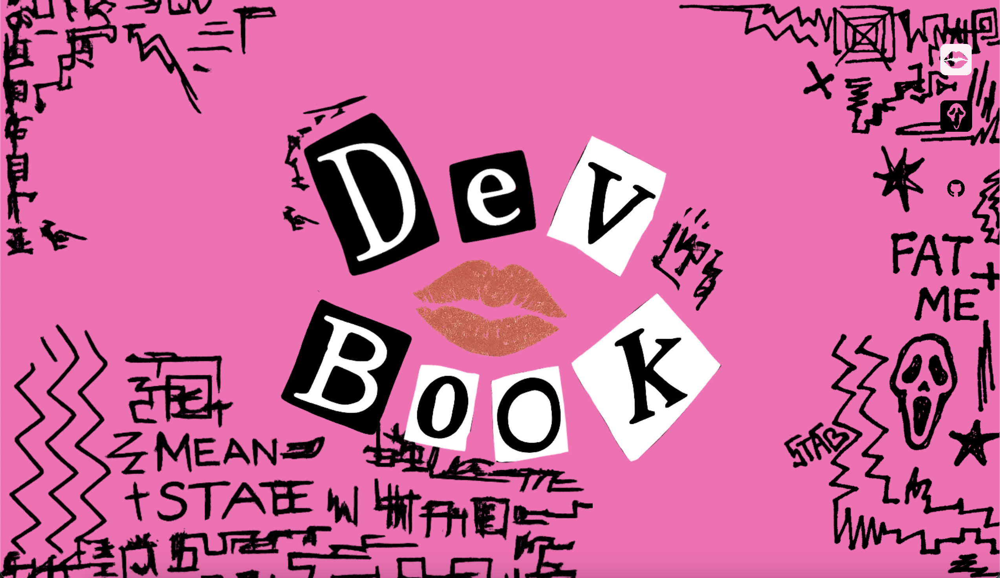

# Personal Website

A personalized, themed portfolio website built with modern React tools. This site is a creative space to showcase my work, highlight projects, and experiment with design, animation, and customization.

## 🛠 Tech Stack

- **React** – Frontend framework
- **React Router v7** – Routing for a multi-page experience
- **Material UI (MUI)** – UI component library
- **Emotion** – CSS-in-JS for custom styled components
- **Framer Motion** – For smooth, performant animations
- **Netlify** – Hosting and deployment

## ✨ Features

- 🎭 **Two Unique Themes**:
  - **Mean Girls Theme** – Light mode with glam and sass
  - **Scream Theme** – Dark mode with horror vibes
- 🏠 **Animated Home Page** – Built with Framer Motion
- 👤 **Character Personalization** – Selectable characters to tailor the UI experience
- 📖 **Project Process Pages** – Deep dives into my workflows and technical decisions
- 🧩 Modular structure for easy expansion and updates

## 📁 Project Structure

```
.
├── public/
│ └── netlify-form-dummy.html # Hidden static form for Netlify bot detection
│
├── app/
│ ├── components/ # Reusable React components
│ ├── home/ # Home page components
│ ├── routes/ # Main pages
│ ├── theme/ # Theme wrappers and logic
│ ├── root.tsx # Main app entry
│ └── routes.ts # Routes config
│
├── README.md
│
├── package.json
│
└── ...
```

## 🚧 Work in Progress

- 📱 **Mobile Responsiveness** – Currently optimizing layouts and interactivity for smaller screens
- ♿ **Accessibility** – Improvements in keyboard navigation, contrast, and ARIA support

## 🚀 Getting Started

### Installation

Install the dependencies:

```bash
npm install
```

### Development

Start the development server with HMR:

```bash
npm run dev
```

## Building for Production

Create a production build:

```bash
npm run build
```

## 🌐 Live Site

Check out the deployed site here:

[](https://martaccferreira.dev)

---

Feel free to explore, test the themes, and view my featured projects! 🤲🏻
